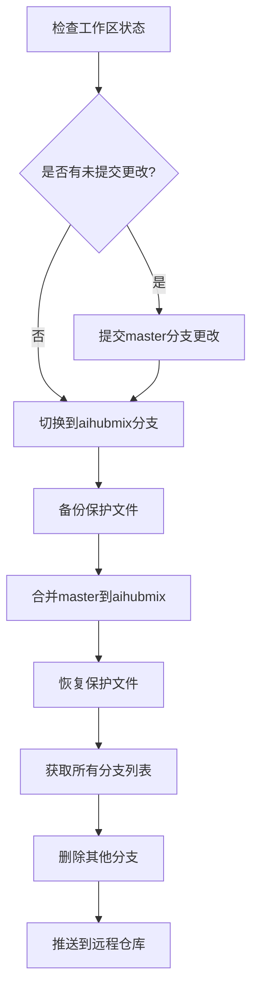
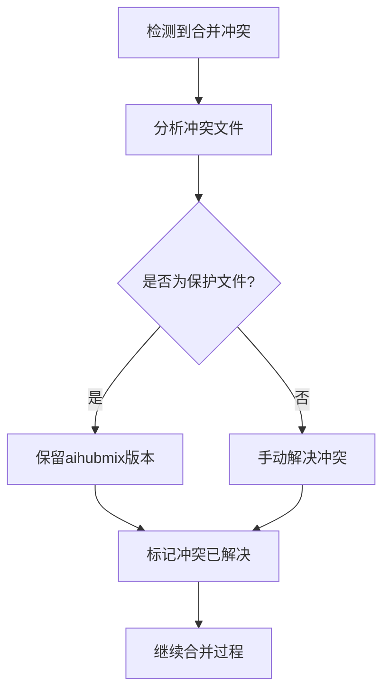

# Git分支同步与清理设计

## 概述

本设计文档描述了Wiseflow项目中Git分支同步和清理的完整流程，涉及从master分支同步代码到aihubmix分支、保护特定文件不被覆盖、清理无用分支以及远程同步等操作。

## 操作目标

1. 将master分支的最新代码同步到aihubmix分支
2. 保护aihubmix分支中的特定文件不被同步覆盖
3. 清理除master和aihubmix外的其他分支
4. 将所有变更同步到远程仓库

## 技术架构

### 分支管理策略



### 文件保护机制

| 文件路径 | 保护原因 | 处理方式 |
|---------|----------|----------|
| `env_sample` | aihubmix分支特定配置 | 备份后恢复 |
| `core/wis/llmuse.py` | aihubmix分支特定实现 | 备份后恢复 |

## 操作流程详解

### 阶段1: 准备工作

#### 1.1 检查当前分支状态
```bash
# 获取当前分支
git branch --show-current

# 检查工作区状态
git status --porcelain
```

#### 1.2 处理未提交的更改
如果master分支有未提交的更改:
```bash
# 添加所有更改
git add .

# 提交更改
git commit -m "Pre-sync commit: staging changes before branch synchronization"
```

### 阶段2: 分支同步操作

#### 2.1 切换到目标分支
```bash
# 切换到aihubmix分支
git checkout aihubmix

# 确保分支是最新的
git pull origin aihubmix
```

#### 2.2 备份保护文件
```bash
# 创建临时备份目录
mkdir -p /tmp/aihubmix_backup

# 备份env_sample
cp env_sample /tmp/aihubmix_backup/

# 备份llmuse.py
cp core/wis/llmuse.py /tmp/aihubmix_backup/
```

#### 2.3 执行分支合并
```bash
# 合并master分支到aihubmix
git merge master --no-ff -m "Sync: merge master into aihubmix while preserving protected files"
```

#### 2.4 恢复保护文件
```bash
# 恢复env_sample
cp /tmp/aihubmix_backup/env_sample ./

# 恢复llmuse.py
cp /tmp/aihubmix_backup/llmuse.py core/wis/

# 添加恢复的文件到暂存区
git add env_sample core/wis/llmuse.py

# 提交保护文件的恢复
git commit -m "Restore protected files: env_sample and llmuse.py for aihubmix branch"
```

### 阶段3: 分支清理

#### 3.1 获取分支列表
```bash
# 获取所有本地分支
git branch --format='%(refname:short)'

# 获取所有远程分支
git branch -r --format='%(refname:short)'
```

#### 3.2 删除本地分支
```bash
# 获取需要删除的分支（排除master和aihubmix）
branches_to_delete=$(git branch --format='%(refname:short)' | grep -v -E '^(master|aihubmix)$')

# 删除本地分支
for branch in $branches_to_delete; do
    git branch -D "$branch"
done
```

#### 3.3 删除远程分支
```bash
# 获取需要删除的远程分支
remote_branches_to_delete=$(git branch -r --format='%(refname:short)' | grep -v -E '^origin/(master|aihubmix)$' | sed 's/origin\///')

# 删除远程分支
for branch in $remote_branches_to_delete; do
    git push origin --delete "$branch"
done
```

### 阶段4: 远程同步

#### 4.1 推送更新
```bash
# 推送aihubmix分支到远程
git push origin aihubmix

# 推送master分支到远程（如果有更新）
git checkout master
git push origin master

# 切换回aihubmix分支
git checkout aihubmix
```

#### 4.2 清理远程跟踪分支
```bash
# 清理已删除的远程跟踪分支
git remote prune origin
```

## 错误处理与回滚

### 合并冲突处理



### 回滚策略

如果操作过程中出现问题，可以使用以下回滚方案:

1. **合并前回滚**:
```bash
# 重置到合并前状态
git reset --hard HEAD~1
```

2. **完全回滚**:
```bash
# 使用reflog查找操作前的commit
git reflog

# 重置到指定commit
git reset --hard <commit-hash>
```

## 验证检查

### 同步完成后验证

1. **分支状态检查**:
```bash
# 确认当前分支
git branch --show-current

# 检查分支关系
git log --oneline --graph --all -10
```

2. **保护文件验证**:
```bash
# 验证env_sample内容
cat env_sample

# 验证llmuse.py内容
head -20 core/wis/llmuse.py
```

3. **远程同步验证**:
```bash
# 检查远程分支状态
git branch -r

# 验证推送状态
git status
```

## 安全考虑

### 数据保护措施

1. **备份机制**: 在操作前创建关键文件的备份
2. **操作日志**: 记录所有Git操作的详细日志
3. **分阶段提交**: 将操作分解为多个小的提交，便于问题定位和回滚

### 权限控制

1. **分支保护**: 确保操作者具有相应分支的写权限
2. **远程操作**: 验证远程仓库的访问权限
3. **文件权限**: 保持原有文件的权限设置

## 性能优化

### 操作效率

1. **批量操作**: 将相同类型的操作批量执行
2. **并行处理**: 在安全的情况下并行执行独立操作
3. **增量同步**: 仅同步有变更的内容

### 网络优化

1. **本地优先**: 优先进行本地操作，最后统一推送
2. **压缩传输**: 使用Git的压缩功能减少网络传输
3. **连接复用**: 复用Git连接减少握手开销