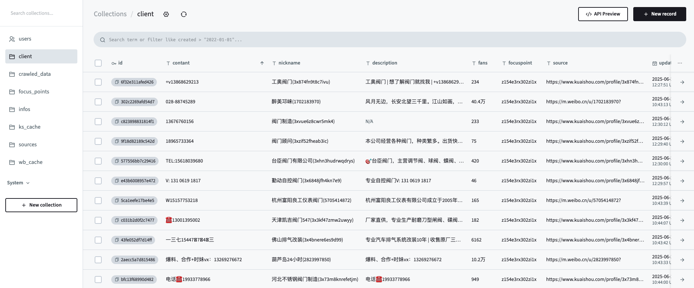
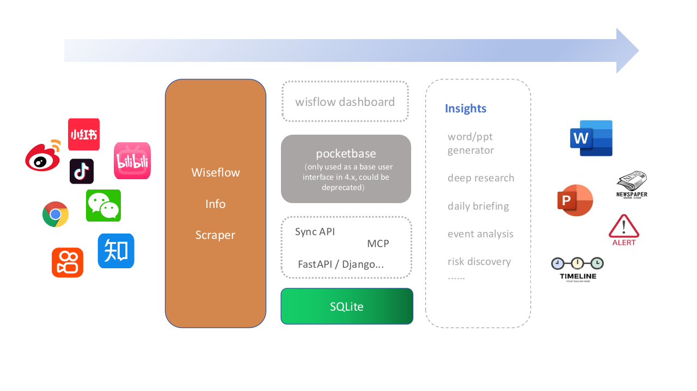

# AI首席情报官（Wiseflow）

**[English](README_EN.md) | [日本語](README_JP.md) | [한국어](README_KR.md) | [Deutsch](README_DE.md) | [Français](README_FR.md) | [العربية](README_AR.md)**

[](https://deepwiki.com/TeamWiseFlow/wiseflow)

🚀 **使用大模型从海量信息、各类信源中每日挖掘你真正感兴趣的信息！**

我们缺的不是信息，而是从海量信息中过滤噪音，从而让有价值的信息显露出来

https://github.com/user-attachments/assets/48998353-6c6c-4f8f-acae-dc5c45e2e0e6

## 🔥🔥🔥 Wiseflow 4.1 版本正式发布！

4.1版本在4.0版本基础上又带来了诸多激动人心的新功能！

### 🔍 自定义搜索源

4.1版本支持为关注点精准配置搜索源，目前支持 bing、github、arxiv 和 ebay 四个搜索源，且均使用平台原生接口，无需额外申请第三方服务。


### 🧠 让 AI 站在你的立场上思考！

4.1版本支持为 focuspoint 设定角色和目的，从而指导 LLM 以特定视角或目的进行分析和提取。但使用时请注意：

    - 如果关注点本身指向性很具体，那么角色和目的的设定对结果影响不大；
    - 影响最终结果质量的第一要素永远是信源，一定要提供与关注点高度相关的信源。

有关角色和目的设定对提取结果影响的测评案例，请参考 [task1](test/reports/report_v4x_llm/task1)

### ⚙️ 自定义提取模式

现在你可以在 pb 界面下创建自己的表单，并配置给特定的关注点，LLM 将按照表单字段进行精准提取。

### 👥 社交平台信源支持创作者查找模式

现在可以指定程序按关注点在社交平台上查找相关内容，并进一步查找内容的创作者主页信息。结合"自定义提取模式"，wiseflow可以帮助你在全网搜索潜在客户、合作伙伴或者投资人的联系方式。



**有关 4.1 版本的更多更新信息，详见 [CHANGELOG](CHANGELOG.md)**

## 🧐  'deep search' VS 'wide search'

我把 wiseflow 的产品定位称为"wide search", 这是相对于目前大火的"deep search"而言。

具体而言"deep search"是面向某一具体问题由 llm 自主动态规划搜索路径，持续探索不同页面，采集到足够的信息后给出答案或者产出报告等；但是有的时候，我们并不带着具体的问题进行搜索，也并不需要深入探索，只需要广泛的信息采集（比如行业情报搜集、对象背景信息搜集、客户信息采集等），这个时候广度明显更有意义。虽然使用"deep search"也能实现这个任务，但那是大炮打蚊子，低效率高成本，而 wiseflow 就是专为这种"wide search"场景打造的利器。

## ✋ What makes wiseflow different from other ai-powered crawlers?

- 全平台的获取能力，包括网页、社交媒体（目前提供对微博和快手平台的支持）、RSS 信源、bing、github、arxiv、ebay 等；
- 独特的 html 处理流程，自动按关注点提取信息并发现值得进一步探索的链接，且仅需 14b 参数量的大模型即可很好的工作；
- 面向普通用户（而非开发者），无需人工介入提供 Xpath，"开箱即用"；
- 持续迭代带来的高稳定性和高可用性，以及兼顾系统资源和速度的处理效率；
- 将不仅仅是“爬虫”……



(4.x 架构整体规划图。虚线框内为尚未完成的部分，希望有能力的社区开发者加入我们，贡献 PR。 所有contributor都将免费获赠 pro 版本的使用权！)

## 🌟 快速开始

**只需三步即可开始使用！**

**windows 用户请提前下载 git bash 工具，并在 bash 中执行如下命令 [bash下载链接](https://git-scm.com/downloads/win)**

### 📋 下载项目源代码并安装 uv 和 pocketbase

```bash
curl -LsSf https://astral.sh/uv/install.sh | sh
git clone https://github.com/TeamWiseFlow/wiseflow.git
```

上述操作会完成 uv 的安装。

接下来去 [pocketbase docs](https://pocketbase.io/docs/) 下载对应自己系统的 pocketbase 程序放置于 [.pb](./pb/) 文件夹下

也可以尝试使用 install_pocketbase.sh (for MacOS/Linux) 或 install_pocketbase.ps1 (for Windows) 来安装。

### 📥 参考 env_sample 配置 .env 文件

在 wiseflow 文件夹（项目根目录）参考 env_sample 创建 .env 文件，并填入相关设定信息。

4.x 版本无需用户在.env 中提供 pocketbase 的账密，也不限定 pocketbase 的版本, 同时我们也暂时取消了 Secondary Model 的设定, 因此你其实最少仅需四个参数即可完成配置：

- LLM_API_KEY="" # LLM 服务的 key （任何提供 OpenAI 格式 API 的模型服务商均可，本地使用 ollama 部署则无需设置）
- LLM_API_BASE="https://api.siliconflow.cn/v1" # LLM 服务接口地址（中国大陆地区用户推荐使用siliconflow）
- PRIMARY_MODEL=Qwen/Qwen3-14B # 推荐 Qwen3-14B 或同量级思考模型
- VL_MODEL=Pro/Qwen/Qwen2.5-VL-7B-Instruct # better to have

### 🚀  起飞！

```bash
cd wiseflow
uv venv # 仅第一次执行需要
source .venv/bin/activate  # Linux/macOS
# 或者在 Windows 上：
# .venv\Scripts\activate
uv sync # 仅第一次执行需要
python -m playwright install --with-deps chromium # 仅第一次执行需要
chmod +x run.sh # 仅第一次执行需要
./run.sh
```

详细使用教程请参考 [docs/manual/manual.md](./docs/manual/manual.md)

## 📚 如何在您自己的程序中使用 wiseflow 抓取出的数据

wiseflow 所有抓取数据都会即时存入 pocketbase，因此您可以直接操作 pocketbase 数据库来获取数据。

PocketBase作为流行的轻量级数据库，目前已有 Go/Javascript/Python 等语言的SDK。  

欢迎在如下 repo 中分享并推广您的二次开发应用案例！

- https://github.com/TeamWiseFlow/wiseflow_plus


## 🛡️ 许可协议

本项目基于 [Apache2.0](LICENSE) 开源。

商用合作，请联系 **Email：zm.zhao@foxmail.com**

- 商用客户请联系我们报备登记，开源版本承诺永远免费。

## 📬 联系方式

有任何问题或建议，欢迎通过 [issue](https://github.com/TeamWiseFlow/wiseflow/issues) 留言。

## 🤝 本项目基于如下优秀的开源项目：

- Crawl4ai（Open-source LLM Friendly Web Crawler & Scraper） https://github.com/unclecode/crawl4ai
- MediaCrawler（xhs/dy/wb/ks/bilibili/zhihu crawler） https://github.com/NanmiCoder/MediaCrawler
- NoDriver（Providing a blazing fast framework for web automation, webscraping, bots and any other creative ideas...） https://github.com/ultrafunkamsterdam/nodriver
- Pocketbase（Open Source realtime backend in 1 file） https://github.com/pocketbase/pocketbase
- Feedparser（Parse feeds in Python） https://github.com/kurtmckee/feedparser
- SearXNG（a free internet metasearch engine which aggregates results from various search services and databases） https://github.com/searxng/searxng

## Citation

如果您在相关工作中参考或引用了本项目的部分或全部，请注明如下信息：

```
Author：Wiseflow Team
https://github.com/TeamWiseFlow/wiseflow
Licensed under Apache2.0
```

## 友情链接

[](https://siliconflow.com/)