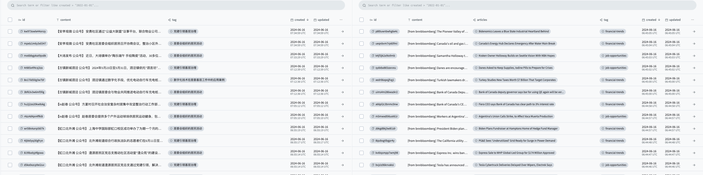

# 首席情报官（Wiseflow）

**[English](README_EN.md) | [日本語](README_JP.md) | [한국어](README_KR.md)**

🚀 **首席情报官**（Wiseflow）是一个敏捷的信息挖掘工具，可以从网站、微信公众号、社交平台等各种信息源中按设定的关注点提炼讯息，自动做标签归类并上传数据库。

**我们缺的其实不是信息，我们需要的是从海量信息中过滤噪音，从而让有价值的信息显露出来**

🌱看看首席情报官是如何帮您节省时间，过滤无关信息，并整理关注要点的吧！🌱

- ✅ 通用网页内容解析器，综合使用统计学习（依赖开源项目GNE）和LLM，适配90%以上的新闻页面；
（**WiseFlow尤其擅长从微信公众号文章中提取信息**，为此我们配置了mp article专属解析器！）
- ✅ 异步任务架构；
- ✅ 使用LLM进行信息提取和标签分类（最低只需使用9B大小的LLM就可完美执行任务）！

https://github.com/TeamWiseFlow/wiseflow/assets/96130569/bd4b2091-c02d-4457-9ec6-c072d8ddfb16



## 🔥 V0.3.1 更新
    
👏 虽然部分9b大小的LLM（THUDM/glm-4-9b-chat）已经可以实现稳定的信息提取输出，但是我们发现对于复杂含义的tag（比如“党建”）或者需要特指的tag（比如仅需采集“居民区活动”，而不希望包括诸如演唱会这样的大型活动信息），
使用目前的prompt还是不能进行准确的提取，因此我们在这一版本中为每个tag增加了explaination字段，可以通过输入该字段进行更加清晰的tag指定。

   _注：复杂explaination需要更大规模的模型才能准确理解，具体见 [模型推荐 2024-09-03](###-4. 模型推荐 [2024-09-03])_

👏  另外针对上一版本prompt语言选择的问题（虽然这并不影响输出结果），我们在目前版本中进一步简化了方案，用户无需指定系统语言（这在docker中并不那么直观），系统会根据tag以及tag的explaination判断选择何种语言的
prompt（也就决定了info的输出语言），这进一步简化了wiseflow的部署和使用。【不过目前wiseflow仅支持简体中文和英文两种语言，其他语言的需求可以通过更改 core/insights/get_info.py 中的prompt实现】
    
🌹另外本次更新合并了过去两个月的PR，本次新增contributor如下：

@wwz223 @madizm @GuanYixuan @xnp2020 @JimmyMa99

🌹 感谢大家的贡献！

## 🌟 如何在您的应用中整合wiseflow

wiseflow 是一个原生的LLM应用，仅需7B~9B大小LLM就可以很好的执行信息挖掘、过滤与分类任务，且无需向量模型，系统开销很小，适合各种硬件环境下的本地化以及私有化部署。

wiseflow 将挖掘出的信息存储于自带的Pocketbase数据库中，这意味着整合无需深入了解wiseflow的代码，只需要对数据库进行读取操作即可！

PocketBase作为流行的轻量级数据库，目前已有 Go/Javascript/Python 等语言的SDK。
   - Go : https://pocketbase.io/docs/go-overview/
   - Javascript : https://pocketbase.io/docs/js-overview/
   - python : https://github.com/vaphes/pocketbase

## 🔄 wiseflow 与常见的爬虫工具、LLM-Agent类项目有何不同与关联？

| 特点          | 首席情报官（Wiseflow） | Crawler / Scraper                     | LLM-Agent            |
|-------------|-----------------|---------------------------------------|----------------------|
| **主要解决的问题** | 数据处理（筛选、提炼、贴标签） | 原始数据获取                                | 下游应用                 |
| **关联**      |                 | 可以集成至WiseFlow，使wiseflow具有更强大的原始数据获取能力 | 可以集成WiseFlow，作为动态知识库 |

## 📥 安装与使用

### 1. 克隆代码仓库

🌹 点赞、fork是好习惯 🌹

```bash
git clone https://github.com/TeamWiseFlow/wiseflow.git
cd wiseflow
```

### 2. 推荐使用docker运行

**中国区用户使用前请合理配置网络，或者指定docker hub镜像**

```bash
docker compose up
```

**注意：**
   - 在wiseflow代码仓根目录下运行上述命令；
   - 运行前先创建并编辑.env文件放置在Dockerfile同级目录（wiseflow代码仓根目录），.env文件可以参考env_sample
   - 第一次运行docker container时会遇到报错，这其实是正常现象，因为你尚未为pb仓库创建admin账号。
    
此时请保持container不关闭状态，浏览器打开`http://127.0.0.1:8090/_/ `，按提示创建admin账号（一定要使用邮箱），然后将创建的admin邮箱（再次强调，一定要用邮箱）和密码填入.env文件，重启container即可。

_如您想更改container的时区和语言，请仿照如下命令运行image_

```bash
docker run -e LANG=zh_CN.UTF-8 -e LC_CTYPE=zh_CN.UTF-8 your_image
```

### 2.【备选】直接使用python运行

```bash
conda create -n wiseflow python=3.10
conda activate wiseflow
cd core
pip install -r requirements.txt
```

之后可以参考core/scripts 中的脚本分别启动pb、task和backend （将脚本文件移动到core目录下）
    
**注意：**
   - 一定要先启动pb，至于task和backend是独立进程，先后顺序无所谓，也可以按需求只启动其中一个；
   - 需要先去这里 https://pocketbase.io/docs/ 下载对应自己设备的pocketbase客户端，并放置在 /core/pb 目录下
   - pb运行问题（包括首次运行报错等）参考 [core/pb/README.md](/core/pb/README.md)
   - 使用前请创建并编辑.env文件，放置在wiseflow代码仓根目录（core目录的上级），.env文件可以参考env_sample，详细配置说明见下
    

📚 for developer， see [/core/README.md](/core/README.md) for more
    
通过 pocketbase 访问获取的数据：
   - http://127.0.0.1:8090/_/ - Admin dashboard UI
   - http://127.0.0.1:8090/api/ - REST API
    

### 3. 配置

复制目录下的env_sample，并改名为.env, 参考如下 填入你的配置信息（LLM服务token等）
    
**windows用户如果选择直接运行python程序，可以直接在 “开始 - 设置 - 系统 - 关于 - 高级系统设置 - 环境变量“ 中设置如下项目，设置后需要重启终端生效**

   - LLM_API_KEY # 大模型推理服务API KEY
   - LLM_API_BASE # 本项目依赖openai sdk，只要模型服务支持openai接口，就可以通过配置该项正常使用，如使用openai服务，删除这一项即可
   - WS_LOG="verbose"  # 设定是否开始debug观察，如无需要，删除即可
   - GET_INFO_MODEL # 信息提炼与标签匹配任务模型，默认为 gpt-4o-mini-2024-07-18
   - REWRITE_MODEL # 近似信息合并改写任务模型，默认为 gpt-4o-mini-2024-07-18
   - HTML_PARSE_MODEL # 网页解析模型（GNE算法效果不佳时智能启用），默认为 gpt-4o-mini-2024-07-18
   - PROJECT_DIR # 数据、缓存以及日志文件存储位置，相对于代码仓的相对路径，默认不填就在代码仓
   - PB_API_AUTH='email|password' # pb数据库admin的邮箱和密码（注意一定是邮箱，可以是虚构的邮箱）
   - PB_API_BASE  # 正常使用无需这一项，只有当你不使用默认的pocketbase本地接口（8090）时才需要
    
    
### 4. 模型推荐 [2024-09-03]

经过反复测试（中英文任务）**GET_INFO_MODEL**、**REWRITE_MODEL**、**HTML_PARSE_MODEL** 三项最小可用模型分别为：**"THUDM/glm-4-9b-chat"**、**"Qwen/Qwen2-7B-Instruct"**、**"Qwen/Qwen2-7B-Instruct"**
    
目前，SiliconFlow已经官宣Qwen2-7B-Instruct、glm-4-9b-chat在线推理服务免费，这意味着您可以“零成本”使用wiseflow啦！
      
😄 如果您愿意，可以使用我的[siliconflow邀请链接](https://cloud.siliconflow.cn?referrer=clx6wrtca00045766ahvexw92)，这样我也可以获得更多token奖励 😄

⚠️ **V0.3.1更新**
      
如果您使用带explaination的复杂tag，那么glm-4-9b-chat规模的模型是无法保证准确理解的，目前测试下来针对该类型任务效果比较好的模型为 **Qwen/Qwen2-72B-Instruct** 和 **gpt-4o-mini-2024-07-18** 。
   
针对有需求使用 `gpt-4o-mini-2024-07-18` 的用户，可以尝试第三方代理 **AiHubMix**，支持国内网络环境直连、支付宝充值（实际费率相当于官网86折）

🌹 欢迎使用如下邀请链接 [AiHubMix邀请链接](https://aihubmix.com?aff=Gp54) 注册 🌹

🌍 上述两个平台的在线推理服务均兼容openai SDK，配置`.env `的`LLM_API_BASE`和`LLM_API_KEY`后即可使用。


### 5. **关注点和定时扫描信源添加**
    
启动程序后，打开pocketbase Admin dashboard UI (http://127.0.0.1:8090/_/)
    
#### 5.1 打开 tags表单

通过这个表单可以指定你的关注点，LLM会按此提炼、过滤并分类信息。
    
tags 字段说明：
   - name, 关注点名称
   - explaination，关注点的详细解释或具体约定，如 “仅限上海市官方发布的初中升学信息”（tag name为 上海初中升学信息）
   - activated, 是否激活。如果关闭则会忽略该关注点，关闭后可再次开启。开启和关闭无需重启docker容器，会在下一次定时任务时更新。

#### 5.2 打开 sites表单

通过这个表单可以指定自定义信源，系统会启动后台定时任务，在本地执行信源扫描、解析和分析。

sites 字段说明：
   - url, 信源的url，信源无需给定具体文章页面，给文章列表页面即可。
   - per_hours, 扫描频率，单位为小时，类型为整数（1~24范围，我们建议扫描频次不要超过一天一次，即设定为24）
   - activated, 是否激活。如果关闭则会忽略该信源，关闭后可再次开启。开启和关闭无需重启docker容器，会在下一次定时任务时更新。


### 6. 本地部署

如您所见，本项目最低仅需使用7b\9b大小的LLM，且无需任何向量模型，这就意味着仅仅需要一块3090RTX（24G显存）就可以完全的对本项目进行本地化部署。
    
请保证您的本地化部署LLM服务兼容openai SDK，并配置 LLM_API_BASE 即可。

注：若需让7b~9b规模的LLM可以实现对tag explaination的准确理解，推荐使用dspy进行prompt优化，但这需要累积约50条人工标记数据。详见 [DSPy](https://dspy-docs.vercel.app/)


## 🛡️ 许可协议

本项目基于 [Apache2.0](LICENSE) 开源。

商用以及定制合作，请联系 **Email：35252986@qq.com**

   - 商用客户请联系我们报备登记，产品承诺永远免费。


## 📬 联系方式

有任何问题或建议，欢迎通过 [issue](https://github.com/TeamWiseFlow/wiseflow/issues) 与我们联系。


## 🤝 本项目基于如下优秀的开源项目：

- GeneralNewsExtractor （ General Extractor of News Web Page Body Based on Statistical Learning） https://github.com/GeneralNewsExtractor/GeneralNewsExtractor
- json_repair（Repair invalid JSON documents ） https://github.com/josdejong/jsonrepair/tree/main 
- python-pocketbase (pocketBase client SDK for python) https://github.com/vaphes/pocketbase

## Citation

如果您在相关工作中参考或引用了本项目的部分或全部，请注明如下信息：

```
Author：Wiseflow Team
https://github.com/TeamWiseFlow/wiseflow
Licensed under Apache2.0
```
