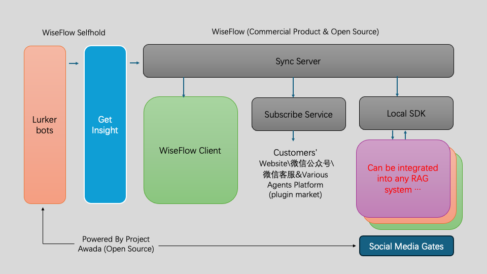

# 首席情报官

**欢迎使用首席情报官**

首席情报官（wiseflow）是一个完备的领域（行业）信息情报采集与分析系统，该系统面向用户开源免费，同时我们提供更加专业的行业情报信息订阅服务【支持社交网络平台信息获取】，欢迎联系我们获取更多信息。

Email：35252986@qq.com 

**首席情报官目前版本主要功能点：**

- 每日关注简报列表
- 入库文章列表、详情，支持一键翻译（简体中文）
- 关注点一键搜索（使用搜狗引擎）
- 关注点一键报告生成（直接生成word文档）
- 行业情报信息订阅【支持指定信源，包括微信公众号、小红书等社交网络平台】（邮件35252986@qq.com联系开通）
- 数据库管理
- 支持针对特定站点的自定义爬虫集成，并提供本地定时扫描任务……

## change log

【2024.5.8】增加对openai SDK的支持，现在可以通过调用llms.openai_wrapper使用所有兼容openai SDK的大模型服务，具体见 [client/backend/llms/README.md](client/backend/llms/README.md)

**产品介绍视频：**

[](https://www.bilibili.com/video/BV17F4m1w7Ed/?share_source=copy_web&vd_source=5ad458dc9dae823257e82e48e0751e25 "wiseflow repo demo")

**打不开看这里**

Youtube：https://www.youtube.com/watch?v=80KqYgE8utE&t=8s

b站：https://www.bilibili.com/video/BV17F4m1w7Ed/?share_source=copy_web&vd_source=5ad458dc9dae823257e82e48e0751e25

## getting started

首席情报官提供了开箱即用的本地客户端，对于没有二次开发需求的用户可以通过如下简单五个步骤即刻起飞！

1、克隆代码仓

```commandline
git clone git@github.com:TeamWiseFlow/wiseflow.git
cd wiseflow/client
```

2、申请开通火山翻译、阿里云dashscope（也支持本地LLM部署）等服务；

3、申请网易有道BCE模型（免费、开源）；

4、参考  /client/env_sample 编辑.env文件;

5、运行 `docker compose up -d` 启动（第一次需要build image，时间较长）


详情参考 [client/README.md](client/README.md)

## SDK & API （coming soon）

我们将很快提供local SDK和subscribe service API服务。

通过local sdk，用户可以无需客户端进行订阅数据同步，并在本地通过python api将数据集成至任何系统，**特别适合各类RAG项目**（欢迎合作，邮件联系 35252986@qq.com）！

而subscribe service将使用户可以将订阅数据查询和推送服务嫁接到自己的微信公众号、微信客服、网站以及各类GPTs bot平台上（我们也会发布各平台的插件）。

### wiseflow架构图



# Citation

如果您在相关工作中参考或引用了本项目的部分或全部，请注明如下信息：

```
Author：Wiseflow Team
https://openi.pcl.ac.cn/wiseflow/wiseflow
https://github.com/TeamWiseFlow/wiseflow
Licensed under Apache2.0
```
# After many comparisons, we recommend the following model for the two tasks of this project (combining effectiveness, speed, and cost performance).
# At the same time, we recommend the siliconflow platform, which can provide online reasoning services for the following two models at a more favorable price
# The siliconflow platform is compatible with openai sdk, which makes the program simple
# Therefore, unless you have experimented and found that there are better options for your data, it is not recommended to change the following two parameters
#  (although you have the right to make any changes at any time).