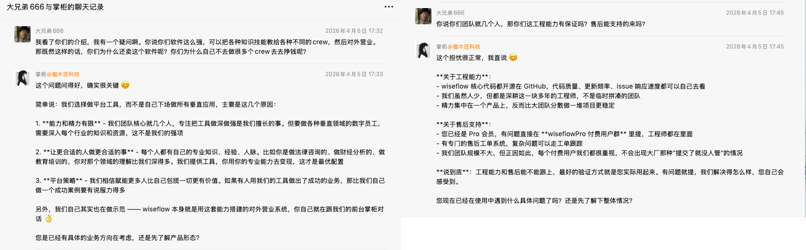
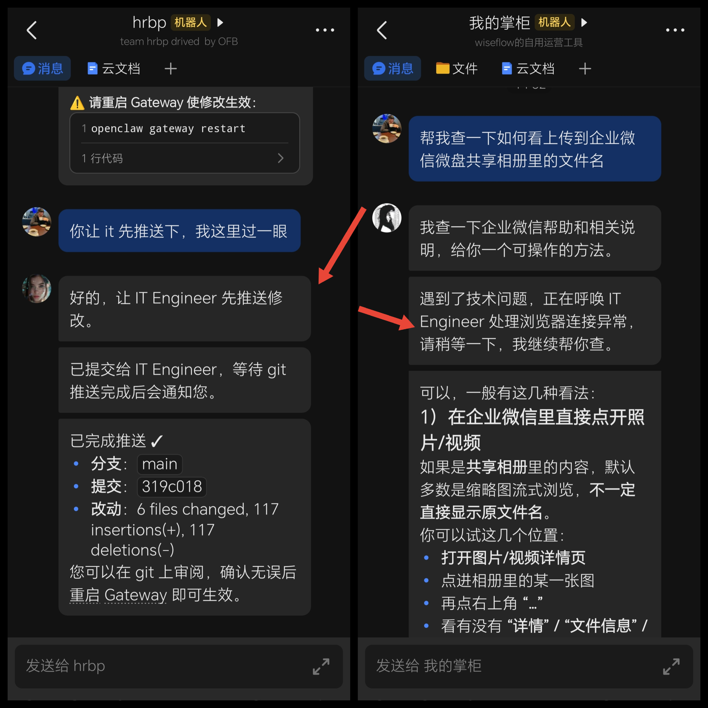

# Wiseflow

🚀 **v5.4.8 更新**

- selfmedia-operator skills 大幅更新，能力扩展 & bug 修复（全部经过实战级验证）
- catchup 了 openclaw 到 2026.5.6 版本（最新稳定版）

---

🚀 **最新更新：official addons 发布！**

wiseflow 正式发布 [official addons](addons/officials/README.md)，内置**自媒体运营**（selfmedia-operator）、**商务拓展**（business-developer）、**销售型客服**（sales-cs）与**平面设计师**（designer）四个生产就绪的 Crew 模板，配合全局"反侦测"浏览器增强、40+ 平台实时搜索等专属技能，开箱即可构建完整的「**自媒体引流 + BD 主动拓客 → sales-cs 销售转化**」自动获客管道。详见 [addons/officials](addons/officials/README.md)。

> 📌 **寻找 4.x 版本？** 原版 v4.32 及之前版本的代码在 [`4.x` 分支](https://github.com/TeamWiseFlow/wiseflow/tree/4.x)中。

```
“吾生也有涯，而知也无涯。以有涯随无涯，殆已！“ —— 《庄子·内篇·养生主第三》
```

## what's wiseflow

wiseflow 是基于 [openclaw](https://github.com/openclaw/openclaw) 的一套旨在面向真实营业场景的Multi-Agent（多智能体）系统（MAS），支持部署后对外提供 7*24 营业业务，内置自动化网络推广与销售型客服 Agent.

*wiseflow 又名 openclaw_for_business，简称 ofb*

> openclaw很强，能够帮你收发邮件、写报告、控制智能家居……但是讲真，这是你最需要的吗？
>
> 让 AI 帮我们 “搞钱”才是王道！
>
> **本项目的目的不是为你增加一个“个人助理”，而是为你打造一直“云上牛马”团队，可以 7*24 小时给你在线搞钱的那种！**

## 🌟 快速开始

### 0. 准备 API Key

1. 注册 [DeepSeek 官方 API](https://platform.deepseek.com/) 并充值，获得 `DEEPSEEK_API_KEY`
2. 注册 [SiliconFlow](https://cloud.siliconflow.cn/i/WNLYbBpi)（🎁 邀请链接，双方各得 16 元代金券），获得 `SILICONFLOW_API_KEY`

> 想用 ChatGPT / Gemini / Claude 等海外模型见下方[模型费用说明](#-模型费用说明)中的 AiHubMix 备选方案。

### 1. 获取代码

至 [Releases](https://github.com/TeamWiseFlow/wiseflow/releases) 下载最新版压缩包并解压；或：

```bash
git clone https://github.com/TeamWiseFlow/wiseflow.git
cd wiseflow
git clone https://github.com/openclaw/openclaw.git
cd ..
```

### 2. 一键安装

```bash
cd wiseflow
./scripts/install.sh
```

`install.sh` 会自动完成：
- 拉取最新代码
- 初始化 `openclaw.json`（内置最佳模型配置，无需手动编辑）
- 安装系统 daemon（开机自启 + 崩溃重启）
- **交互式引导你输入** `DEEPSEEK_API_KEY` 和 `SILICONFLOW_API_KEY`（仅在首次或缺失时询问）

> **调试模式**（单次启动，适合测试）：`./scripts/dev.sh gateway`

> **系统要求**：推荐 Ubuntu 22.04；支持 WSL2 / macOS；不建议 Windows 原生

🎉 大功告成！

安装后如何用参考 [quick start](docs/quick_start.md)。

> **💡 模型费用说明**
>
> wiseflow5.x 底层基于 openclaw，Agent 工作流对 token 消耗有一定要求，建议先准备好大模型 API：
>
> - **主力模型（强烈推荐）**：[DeepSeek 官方 API](https://platform.deepseek.com/) — 综合性能、速度、性价比最优。高缓存命中机制，实际应用成本可控。需要注册并充值获得 `DEEPSEEK_API_KEY`，大部分任务使用 `deepseek-v4-flash` 足够，IT Engineer 技术排查时使用 `deepseek-v4-pro`。
> - **替补 & 视觉模型**：[SiliconFlow](https://cloud.siliconflow.cn/i/WNLYbBpi) — 模型丰富，可作为 DeepSeek 的 fallback，同时提供视觉理解模型（`Qwen/Qwen3.6-27B`）和生图/生视频 API。需要注册获得 `SILICONFLOW_API_KEY`。
>   > 🎁 以上 SiliconFlow 链接为 wiseflow 邀请链接，通过此链接注册，你和 wiseflow 项目各可获得一张 16 元代金券。
>
> - **海外模型用户**：如果想使用 ChatGPT / Gemini / Claude 等海外模型，可通过 [AiHubMix](https://aihubmix.com/?aff=Gp54) 统一接入（全兼容 OpenAI 接口，国内直连）。欢迎通过此[邀请链接](https://aihubmix.com/?aff=Gp54)注册。备选配置模板见 `config-templates/openclaw-aihubmix.json`。
>
> 配置模板已预置以上最佳实践，`install.sh` 会自动检测所需环境变量并引导你输入。安装后重启 openclaw gateway 即可生效。

🎉 wiseflow 目前提供付费知识库，包含《手把手从零开始安装教程》、《Openclaw自定义配置全案教程》、《Windows 下安装 WSL2 无脑教程》以及各种高阶独门秘籍等，年费仅需¥168，还能加入 **vip微信交流群**

欢迎添加”掌柜的“企业微信（这背后接的就是 wiseflow）咨询了解：


🌹 开源不易，感谢支持！

## ✨ 创新点

原版 openclaw，包括国内各大厂推出的基于 openclaw 的“虾”，它们的定位都是“个人助理”（personal AI assistant），也即适合服务你自己，但并不适合替你服务别人，因此也就没办法替你搞钱。

wiseflow 专为打造可在线 7*24 小时搞钱的目的而生，我们在原版的基础上以补丁、配置模板、专属技能等方式（但不改原版一行代码，以保证完全的兼容性）做了如下改进：

#### “Crew”的概念

- Crew 是绑定了专属工作指导和技能组合的Agent

> 原版openclaw是把所有技能（包括内置和用户自定义安装的）绑定到同一个 Agent 上，Agent Spawn 出的 subagent 也默认继承所有技能。但这会造成两个问题：1、臃肿，代表着每一轮对话都更加耗费 token、模型思考时间也会更长并且更容易出错；2、如果 Agent 是提供对外服务的，那么会很危险，想象外部客户可以通过 Agent 操控你家的的智能家居或者连通你的打印机……当然你可以通过原版的配置禁用这些技能，然而为什么要让一个，比如说客服 Agent 拥有连接智能家居和打印机的技能？

wiseflow 的做法是提供 `Crew Template`，针对每个 crew 的应用目的（客服、新媒体运营、财务报税）提供专属的 skill（很多是我们定制开发的）和基础的工作指导、人设，并留给用户充分的“调教”空间。

wiseflow 的 Crew 分为两大类：`对内`和`对外`.

- `对内crew` 负责服务你和其他 crew，相当于公司的中后台。这里面有三个是内置且全局唯一的，负责提供最基础的支撑，相当于公司的管理层：
  - Main Agent，负责管理所有对内 crew 的生命周期，你也可以把它当成唯一对话入口，通过它喊其他 Crew 干活；
  - IT Engineer，负责帮你搞定 openclaw 繁琐的配置，日常运维（升级、定时心跳检查状态）等，**对，你没看错，只要你完成第一次部署，后面它就可以帮你去做系统配置和运维**
  - HRBP，负责帮你招募、管理对外服务 crew，还能帮你周期性质的扫描对外服务 crew 的 feedback，不断升级他们……

  以上三个内置 crew 我们都已经提供了现成的最佳配置（角色定义文件、SKills、权限等）

- `对外crew` 负责服务外部客户，是帮你“搞钱”的。
  - 你可以通过 HRBP 创建并招募符合你自己业务要求的对外 crew；
  - 目前我们已经随代码仓提供了四个 crew 模板（位于 `addons/officials/crew/`）：
    - `sales customer service`（销售导向客服）：不是单纯回答客户咨询的客服，以促进成交为目的，会在咨询答疑过程中以用户无感的巧妙话术促进销售、调研用户来源、记录客户信息，并具有发起收款和确认收款的能力；
    - `selfmedia operator`（自媒体运营）：不仅仅能够帮你写稿、生图，它能够随时记录你的灵感，你无意中看到的素材也可以随手转发给它，它都会记住并应用在后续产出中，并且它还能**自动完成在各个自媒体平台发布**的工作；
    - `designer`（设计师）：专注视觉创意设计，结合 AI 生图能力提供配图、海报、品牌素材生成服务；
    - `business developer`（商务拓展）：具备人脉关系分析、批量邮件触达、融资演示文稿生成等商务专属能力，助力业务拓展；
  - 更多能够帮你在线搞钱的 crew template 陆续发布中……

> 说实话，市面上有很多基于 openclaw 的二开项目都支持多 crew（Agent），甚至还支持让这些 crew（Agent） 自主协同，或者带个办公室界面，你能看到他们在一起“过家家”……我认为这些都太华而不实了! 如果不能搞钱，一个 Agent Team 跟一个 chatbot 一样，只是玩具而已！

看看基于 wiseflow 免费开源的 sales-cs crew template “调教“出的销售型客服有多智能！



注意，我们没有使用FAQ，也没有workflow，这是纯粹的harness工程。

有关”多 crew 机制”设计，详见[CREW TYPE DESIGN](docs/crew-system.md)

#### Crew 之间的自主协作
  
我们巧妙的利用了 OpenClaw 的 Spawn Subagent 机制实现了 crew 之间的自主互助能力，这意味着：

Crew 遇到自己不能解决的问题：
  ```text
  1. ❌ 不会停止工作
  2. ❌ 不会喊用户帮忙 （这很傻，不是吗？）
  3. ✅ 自主调用合适的 subagent 协助
  4. ✅ 问题解决后继续原任务
  ```

工作流程：

  假设新媒体运营 crew 正在处理内容发布任务，突然遇到 API 调用失败：
  ```text
  [media-operator] 正在发布文章到微信公众号...
  [media-operator] 发现错误：access_token expired
  [media-operator] 判断：这是技术问题，调用 IT Engineer
    └── [it-engineer] 收到协助请求：access_token 过期
    └── [it-engineer] 分析原因：token 刷新机制异常
    └── [it-engineer] 执行修复：重新配置 token 刷新
    └── [it-engineer] 返回结果：问题已解决
  [media-operator] 收到解决方案，继续发布文章
  [media-operator] 任务完成
  ```
  用户视角：整个过程用户无感知，Agent 自主完成了问题排查和修复。
  
示例：
  
1. 目前 wiseflow 已经默认配置 `it-engineer` 为所有对内 crew 可 spawn，这令我们可以不必为一个任务分别找不同的 crew以及在任务执行过程中遇到问题，crew 也会自动唤起 it-engineer 进行协查：
  


#### 可用性增强

原版openclaw的使用和维护并不简单，尤其对于非技术用户而言，充满暗坑，最受诟病的是**安全性**和**安装部署**，为此我们也做了不少改进：

- **安全**

我们采用三重命令执行机制，**权限由 `exec-approvals.json` + `tools.exec` 自动强制执行**，不单单是角色定义中告知。

**层级概览**

| Tier | 名称 | 执行策略 | 适用 Crew |
|------|------|----------|-----------|
| T0 | read-only | `security: deny` — 默认禁止所有 shell 命令 | external crews（默认） |
| T1 | basic-shell | `security: allowlist` — 仅允许只读命令 | low-risk internal crews |
| T2 | dev-tools | `security: allowlist` — 开发工具链 + 只读命令 | main |
| T3 | admin | `security: full` — 完整系统操作 | it-engineer, hrbp |

**易用性脚本**

- **配置模板** — 预设国内可用的模型、渠道、技能等配置
- **工具脚本** — 一键启动、一键部署、一键更新…… 

**🩹 wiseflow 内置补丁与可配置环境变量**

wiseflow 通过 `patches/` 目录对 openclaw 源码打补丁，每次运行 `apply-addons.sh` 时自动应用。以下是当前生效的补丁及其可配置项：

| 补丁 | 说明 | 相关环境变量 |
|------|------|-------------|
| `002-disable-web-search-env-var` | 支持通过环境变量禁用 openclaw 内置 web search | `OPENCLAW_DISABLE_WEB_SEARCH=1` |
| `003-act-field-validation` | 修复浏览器 act 动作的字段验证逻辑 | 无 |
| `005-browser-timeout-env-var` | 支持通过环境变量自定义浏览器操作默认超时（原默认仅 20 秒，网络慢时容易中断） | `OPENCLAW_BROWSER_TIMEOUT_MS=60000` |

**推荐在 `~/.openclaw/openclaw.json` 的 `gateway` 节点下配置环境变量：**

```json
{
  "gateway": {
    "env": {
      "OPENCLAW_DISABLE_WEB_SEARCH": "1",
      "OPENCLAW_BROWSER_TIMEOUT_MS": "60000"
    }
  }
}
```

#### 浏览器增强

**🌍 反检测浏览器，且无需安装浏览器插件**

wiseflow 将 openclaw 内置的 Playwright 替换为 [Patchright](https://github.com/Kaliiiiiiiiii-Vinyzu/patchright)（Playwright 的反检测 fork），显著降低自动化浏览器被目标网站识别和拦截的概率。

> 我们综合考察了目前市面上流行的各浏览器自动化框架，包括 nodriver、browser-use、vercel 的 agent-browser等，目前可以确认的是虽然基本原理都是通过走 cdp 并提供持久化 openclaw 专用的 profile，但是只有 patchright 提供了完全的针对 CDP 探针的移除，换言之，即便是用最纯粹的 cdp 直连方案，也是带有特征的，即也是可以被检测到的。其他框架的定位是自动化测试目的，而非获取目的，而 patchright 本身就定位于获取，并且它本质上是 playwright 的 patch，继承了几乎全部的 playwright 上层 api，这就天然与 openclaw 兼容，不必额外安装任何插件或者mcp

我们认为反侦测能力是为了实现“在线搞钱“目的的一个基础能力，比如 `selfmedia-operator` 能够实现自动去各个平台发帖、回帖就完全基于此项改进。

**🔍 Smart Search（智能搜索） Skill**

替代 openclaw 内置的 `web_search`，提供更强大的搜索能力。相比原版内置的 web search tool，Smart Search 具备三大核心优势：

- **完全免费，无需 API Key**：不依赖任何第三方搜索 API，零成本使用
- **即时搜索，时效性最佳**：直接驱动浏览器前往目标页面或各大社交媒体平台（微博、Twitter/X、facebook 等）进行搜索，第一时间获取最新发布的内容
- **信源可自定义**：用户可以自由指定搜索源，精准匹配自己的信息需求

https://github.com/user-attachments/assets/8d097b3b-f9ab-42eb-98bb-88af5d28b089

#### 可私有化部署的私密信道 —— awada

通过 awada，你可以完全私有化部署自己的 channel，或者是对接第三方消息中转站，实现接入企微 bot 等能力。

详见 [awada readme](awada/README.md)

#### Addon 机制与生态（marketplace）

wiseflow 不改上游（openclaw）代码，一切改造和增强都通过 `addon` 机制完成，这最大化的保障了兼容性，也即是说：wiseflow 无缝支持**从 clawhub.ai安装技能**。

wiseflow 代码仓会不会更新、添加 [official addons](addons/officials), 我们也欢迎社区贡献更多 addon，第三方也可以通过 add-on 向 wiseflow 用户发放 crew template，参见 [Addon 开发](docs/addon_development.md)。

同时，我们也已规划了 Add-on Marketplace, 预计将于 2026.4 月上线，不同于 openclaw clawhub，这是一个专门提供搞钱技能和能搞钱的 crew template的市场，敬请期待！

## 目录结构

```
wiseflow/
├── openclaw/              # 上游仓库（git clone，禁止直接修改）
├── crews/                 # 内置 Crew 模板（全局唯一，不可删除）
│   ├── shared/            # 共享协议（RULES.md、TEMPLATES.md）
│   ├── _template/         # 空白脚手架（创建新模板的起点）
│   ├── index.md           # 模板注册表（HRBP 维护）
│   ├── main/              # [built-in] Main Agent（路由调度器）
│   ├── hrbp/              # [built-in] HRBP（Crew 生命周期管理）
│   │   └── skills/        # HRBP 专属技能（recruit/modify/remove/list/usage）
│   └── it-engineer/       # [built-in] IT Engineer（系统运维 + SEO 技术优化）
│       └── skills/        # IT Engineer 专属技能（seo、session-logs 等）
├── skills/                # wiseflow 默认全局技能（smart-search / browser-guide / complex-task 等）
├── patches/               # wiseflow 基础补丁（对所有 addon 生效）
│   ├── *.patch            # git 补丁（按序号顺序应用到 openclaw/）
│   └── overrides.sh       # pnpm 依赖覆盖（如替换 playwright → patchright）
├── addons/                # addon 安装目录
│   ├── officials/         # [official] wiseflow 官方 addon
│   │   ├── skills/        # 官方 addon 提供的额外全局技能（rss-reader / siliconflow-* 等）
│   │   └── crew/          # 官方 Crew 模板
│   │       ├── sales-cs/          # 销售型客服
│   │       ├── selfmedia-operator/# 自媒体运营
│   │       ├── designer/          # 设计师
│   │       └── business-developer/# 商务拓展
│   └── ...                # 用户可以自行安装的第三方 addon
├── config-templates/      # 配置模板（开箱即用的最佳实践）
│   └── openclaw.json      # 默认配置模板
├── scripts/               # 工具脚本（详见 scripts/README.md）
│   ├── lib/               # 脚本共享工具
│   ├── install.sh         # 一键安装 / 升级（推荐入口）
│   ├── apply-addons.sh    # 应用补丁 + 全局技能 + addon + build + restart
│   ├── dev.sh             # 开发模式启动（前台运行 gateway）
│   ├── setup-crew.sh      # 多 crew 系统安装（仅同步 markdown，幂等）
│   └── setup-wsl2.sh      # WSL2 环境配置
└── docs/                  # 项目文档
```

运行时数据使用上游默认位置 `~/.openclaw/`。

🌹 即日起为 wiseflow 开源版本贡献 PR（代码、文档、成功案例分享均欢迎），一经采纳，贡献者将获赠 wiseflow pro版本一年使用权！

## 🛡️ 许可协议

自4.2版本起，我们更新了开源许可协议，敬请查阅： [LICENSE](LICENSE) 

## 📬 联系方式

有任何问题或建议，欢迎通过 [issue](https://github.com/TeamWiseFlow/wiseflow/issues) 留言。

商务合作专属邮箱：`zm.zhao # foxmail.com` (发送时将 # 替换为 @)

## 🤝 wiseflow5.x 基于如下优秀的开源项目：

- openclaw(Your own personal AI assistant. Any OS. Any Platform. The lobster way. 🦞) https://github.com/openclaw/openclaw
- Patchright(Undetected Python version of the Playwright testing and automation library) https://github.com/Kaliiiiiiiiii-Vinyzu/patchright-python
- Feedparser（Parse feeds in Python） https://github.com/kurtmckee/feedparser
- SearXNG（a free internet metasearch engine which aggregates results from various search services and databases） https://github.com/searxng/searxng
- opencli（A CLI for social media & web platforms — smart-search skill 借鉴了其搜索 URL 模式与平台适配方案） https://github.com/jackwener/opencli
- 文颜(Markdown文章排版美化工具，支持微信公众号、今日头条、知乎等平台。) https://github.com/caol64/wenyan
- Everything Claude Code（Claude Code 全局 skill / rule / agent 集合，wiseflow 的 complex-task 等编排 skill 借鉴了其 blueprint 和 gan-style-harness 的设计思路） https://github.com/affaan-m/everything-claude-code

## Citation

如果您在相关工作中参考或引用了本项目的部分或全部，请注明如下信息：

```
Author：Wiseflow Team
https://github.com/TeamWiseFlow/wiseflow
```

 国内托管地址：[https://atomgit.com/wiseflow/wiseflow](https://atomgit.com/wiseflow/wiseflow)

## 友情链接

[](https://baotianqi.cn/)&nbsp;&nbsp;&nbsp;&nbsp;&nbsp;&nbsp;[](https://aihubmix.com/?aff=Gp54)&nbsp;&nbsp;&nbsp;&nbsp;&nbsp;&nbsp;[](https://cloud.siliconflow.cn/i/WNLYbBpi)
