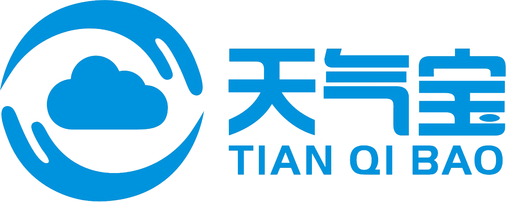
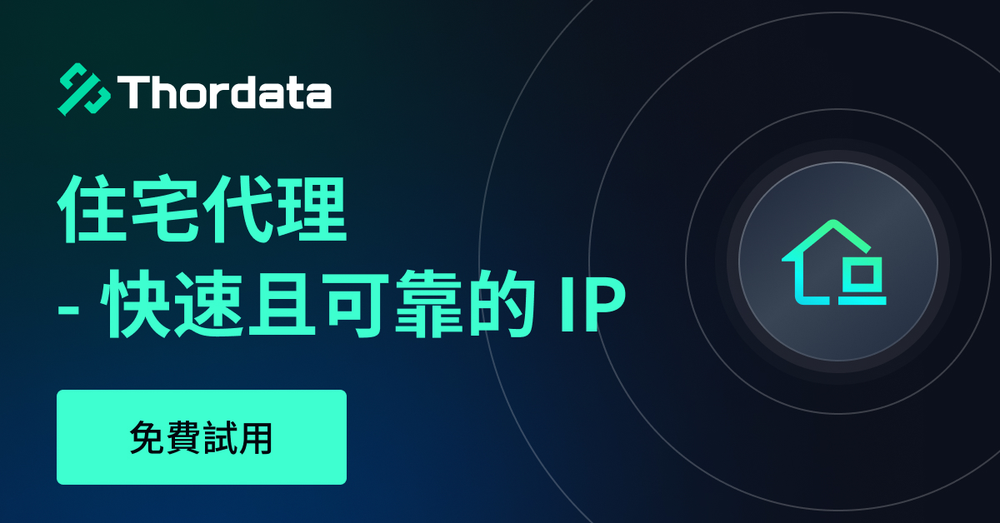

# AI 최고 정보 책임자 (Wiseflow)

**[简体中文](README.md) | [English](README_EN.md) | [日本語](README_JP.md) | [한국어](README_KR.md) | [Deutsch](README_DE.md) | [Français](README_FR.md) | [العربية](README_AR.md)**

[](https://deepwiki.com/TeamWiseFlow/wiseflow)

🚀 **대규모 언어 모델을 사용하여 다양한 소스에서 당신이 가장 관심 있는 정보를 매일 추적하세요!**

wiseflow는 주요 소셜 미디어, 웹사이트, RSS, 검색 엔진을 포함한 다양한 네트워크 소스를 지능적으로 모니터링하고 추적하며, 그 중에서 당신이 가장 관심 있는 정보를 지능적으로 추출합니다.

## 🎉 WiseFlow Pro 버전이 출시되었습니다!

더 강력한 크롤링 능력, 더 포괄적인 소셜 미디어 지원, UI 인터페이스 및 무설치 원클릭 실행 패키지 포함!

https://github.com/user-attachments/assets/880af7a3-7b28-44ff-86b6-aaedecd22761

🔥🔥 **Pro 버전은 현재 전 세계에서 판매 중입니다**: https://shouxiqingbaoguan.com/ 

🌹 오늘부터 wiseflow 오픈 소스 버전에 PR(코드, 문서, 성공 사례 공유 모두 환영)을 기여하여 채택된 기여자는 wiseflow pro 버전 1년 사용권을 증정합니다!

## Wiseflow 4.30 오픈 소스 버전

wiseflow 오픈 소스 버전은 이제 pro 버전과 동일한 아키텍처로 업그레이드되었으며, 동일한 API를 갖추고 있어 [wiseflow+](https://github.com/TeamWiseFlow/wiseflow-plus) 생태계를 원활하게 공유할 수 있습니다!

## 스폰서

Powered By <a href="https://www.baotianqi.cn" target="_blank"></a>

[Thordata](https://www.thordata.com/?ls=github&lk=wiseflow): 합리적인 가격으로 신뢰할 수 있는 글로벌 프록시를 이용하세요. 엔터프라이즈급 안정성과 규정 준수를 갖춘 원클릭 데이터 수집. 대규모 운영을 위해 ThorData를 사용하는 수천 명의 개발자와 함께하세요.

🎁 독점 혜택: 주거용 프록시 무료 체험과 2,000회의 무료 SERP API 호출에 가입하세요!

<a href="https://www.thordata.com/?ls=github&lk=wiseflow" target="_blank"></a>

## wiseflow 오픈 소스 버전과 pro 버전 비교

| 기능 특성 | 오픈 소스 버전 | Pro 버전 |
| :--- | :---: | :---: |
| **모니터링 소스 지원** | web, rss | web, rss, 추가 7개 주요 중국 자미디어 플랫폼 |
| **검색 소스 지원** | bing, github, arxiv | bing, github, arxiv, 추가 6개 주요 중국 자미디어 플랫폼 |
| **설치 및 배포** | 수동 환경 설치 및 배포 필요 | 설치 불필요, 원클릭 실행 |
| **사용자 인터페이스** | 없음 | 중국어 웹 UI |
| **LLM 비용** | 사용자가 직접 LLM 서비스를 구독하거나 로컬 LLM 구축 | 구독에 LLM 호출 비용 포함 (추가 설정 불필요) |
| **기술 지원** | GitHub Issues | 유료 사용자 위챗 그룹 |
| **가격** | 무료 | ￥488/년 |
| **대상 그룹** | 커뮤니티 탐색 및 프로젝트 학습 | 일상적인 사용 (개인 또는 기업) |

## 🧐 wiseflow 제품 포지셔닝

wiseflow는 ChatGPT나 Manus와 같은 범용 에이전트가 아닙니다. 정보 모니터링 및 추출에 집중하며, 사용자가 지정한 소스를 지원하고 정기 작업 모드를 통해 최신 정보를 보장합니다(하루 최대 4회, 즉 6시간마다 정보 획득 지원). 또한 wiseflow는 지정된 플랫폼에서 포괄적인 정보 찾기(예: "사람 찾기")를 지원합니다.

하지만 wiseflow를 전통적인 의미의 크롤러나 RPA와 동일시하지 마십시오! wiseflow의 획득 동작은 전적으로 LLM에 의해 구동되며, 헤드리스 브라우저나 가상 브라우저가 아닌 실제 브라우저를 사용하여 수행되며, 획득과 추출 동작이 동시에 이루어집니다.

- 혁신적인 HTML 지능형 파싱 메커니즘: 핵심 정보와 추가 탐색 가능한 링크를 자동으로 식별합니다.
- "크롤링 및 검색 일체화" 전략: 크롤링 과정에서 LLM이 실시간으로 판단 및 추출하여 관련 정보만 캡처함으로써 리스크 제어 위험을 크게 줄입니다.
- 진정한 즉시 사용 가능: Xpath, 스크립트 또는 수동 설정 없이 일반 사용자도 쉽게 사용할 수 있습니다.

    ……

더 많은 정보는 다음을 참고하세요: https://shouxiqingbaoguan.com/

## 🌟 빠른 시작

**단 세 단계로 시작할 수 있습니다!**

**4.2 버전부터 Google Chrome 브라우저 설치가 필수입니다 (기본 설치 경로 사용).**

**Windows 사용자는 사전에 Git Bash 도구를 다운로드하고 bash에서 다음 명령을 실행하십시오. [bash 다운로드 링크](https://git-scm.com/downloads/win)**

### 📋 환경 관리 도구 uv 설치 및 wiseflow 소스 코드 다운로드

```bash
curl -LsSf https://astral.sh/uv/install.sh | sh
git clone https://github.com/TeamWiseFlow/wiseflow.git
```

위의 작업으로 uv 설치가 완료되고 wiseflow 소스 코드가 다운로드됩니다.

### 📥 env_sample을 참고하여 .env 파일 설정

wiseflow 폴더(프로젝트 루트 디렉토리)에서 env_sample을 참고하여 .env 파일을 생성하고 관련 설정 정보(주로 LLM 서비스 설정)를 입력하십시오.

**wiseflow 오픈 소스 버전은 사용자가 직접 LLM 서비스를 설정해야 합니다.**

wiseflow는 모델 서비스 제공업체를 제한하지 않으며, OpenAI SDK 요청 인터페이스 형식과 호환되는 한 기존 MaaS 서비스나 Ollama 등 로컬 배포 모델 서비스를 선택할 수 있습니다.

중국 본토 사용자의 경우 Siliconflow 모델 서비스 사용을 권장합니다.

😄 제 [추천 링크](https://cloud.siliconflow.cn/i/WNLYbBpi)를 사용하여 신청해 주시면, 귀하와 저 모두 ￥14의 플랫폼 보상을 받게 됩니다.

OpenAI와 같은 해외 폐쇄형 모델을 사용하려는 경우 중국 본토에서 원활하게 작동하는 AiHubMix 모델 서비스를 사용할 수 있습니다:

😄 제 [AiHubMix 초대 링크](https://aihubmix.com?aff=Gp54)를 사용하여 등록해 주세요.

해외 사용자는 Siliconflow의 국제 버전을 사용할 수 있습니다: https://www.siliconflow.com/

### 🚀 시작!

```bash
cd wiseflow
uv venv # 처음 실행할 때만 필요
source .venv/bin/activate  # Linux/macOS
# 또는 Windows에서:
# .venv\Scripts\activate
uv sync # 처음 실행할 때만 필요
python core/entry.py
```

## 📚 자신의 프로그램에서 wiseflow가 수집한 데이터를 사용하는 방법

[wiseflow backend api](./core/backend/README.md) 를 참고하십시오.

wiseflow 기반이든 wiseflow-pro 기반이든, 다음 repo에서 여러분의 응용 사례를 공유하고 홍보하는 것을 환영합니다!

- https://github.com/TeamWiseFlow/wiseflow-plus

(이 repo에 PR을 기여하여 채택되면 wiseflow-pro 1년 사용권이 증정됩니다)

**4.2x 버전 아키텍처는 4.30과 완전히 호환되지 않습니다. 4.2x의 최종 버전(v4.29)은 유지 관리가 중단되었으므로 코드 참고가 필요한 경우 "2025" 브랜치로 전환하십시오.**

## 🛡️ 라이선스

4.2 버전부터 오픈 소스 라이선스 계약을 업데이트했으니 확인해 주십시오: [LICENSE](LICENSE) 

상업적 협력은 **Email: zm.zhao@foxmail.com**으로 문의해 주십시오.

## 📬 연락처

질문이나 제안 사항이 있으면 [issue](https://github.com/TeamWiseFlow/wiseflow/issues)를 통해 메시지를 남겨주세요.

pro 버전에 대한 요구 사항이나 협력 피드백은 AI 최고 정보 책임자 "장궤(掌柜)" 기업 위챗으로 문의해 주십시오:


## 🤝 본 프로젝트는 다음과 같은 우수한 오픈 소스 프로젝트를 기반으로 합니다:

- Crawl4ai (Open-source LLM Friendly Web Crawler & Scraper) https://github.com/unclecode/crawl4ai
- Patchright (Undetected Python version of the Playwright testing and automation library) https://github.com/Kaliiiiiiiiii-Vinyzu/patchright-python
- MediaCrawler (xhs/dy/wb/ks/bilibili/zhihu crawler) https://github.com/NanmiCoder/MediaCrawler
- NoDriver (웹 자동화, 웹 스크래핑, 봇 및 기타 창의적인 아이디어를 위한 초고속 프레임워크 제공) https://github.com/ultrafunkamsterdam/nodriver
- Feedparser (Python에서 피드 파싱) https://github.com/kurtmckee/feedparser
- SearXNG (다양한 검색 서비스 및 데이터베이스의 결과를 집계하는 무료 인터넷 메타 검색 엔진) https://github.com/searxng/searxng

## Citation

관련 작업에서 본 프로젝트의 일부 또는 전부를 참조하거나 인용하는 경우 다음 정보를 명시해 주십시오:

```
Author: Wiseflow Team
https://github.com/TeamWiseFlow/wiseflow
```

## 우호 링크

[](https://siliconflow.com/)
