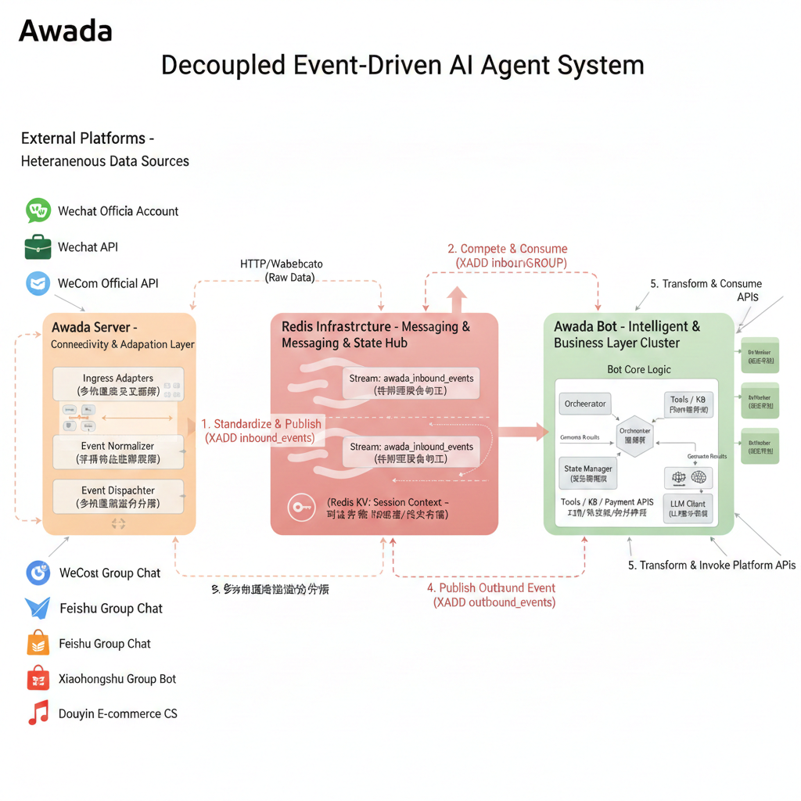
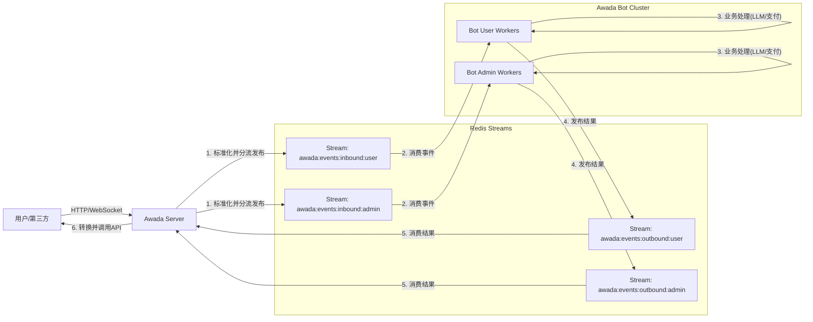

# awada 定义与约定

awada 是一套为 llm 应用打造的 CUI(conversational user interface) 框架，它旨在让 demo 级的 llm 应用变身为生产级的产品。

awada 包含三块核心模组： awada server、redis infrastructure、awada bot

awada 系统所涉及的概念和约定如下：

#### 消息通道

消息通道指一条外部通信渠道，比如微信客服api、飞书 api、小红书群组 api、企业微信 api、第三方微信网关 api……

在 awada 系统中，消息通道完全由 awada server 管理，awada bot 不关心消息从何而来，处理好的消息又将发往哪里……

- **在 awada1.x 版本中，一个 server 实例可以对接多条通道，但是一个通道只能对接一个 server 实例**

### 消息事件

awada server 和 awada bot 之间的通信的基础元素是 消息事件，简称”事件“，MSG Event

消息事件表现为数据上，是一个特定格式的 dict，格式约定见第二部分（文末）

#### 消息事件队列

awada server 和 awada bot 之间靠消息事件队列（Stream）传递消息事件，

在 awada1.x 版本中，消息事件队列依靠 redis infrastructure 维护

#### 消息事件线路（lane）

打一个形象的比喻，上海到北京的高铁线路，虽然叫”线路“，但它不可能是单一一条铁轨，而是双向两条铁轨。我们熟悉的公路也是这样，基本都得是双向双车道、四车道，高速公路甚至可能是八车道、十车道……

同样，在生产级环境中，消息事件队列（stream）不可能是单独出现的，而是都需要成组出现的，这样一组stream 的集合称之为 lane。

它代表了一个特定的线路，比如连接用户和bot、 连接管理员和bot、连接某一个用户和某次特定市场活动的bot……

awada1.x 版本中，一个 lane 包含四条 stream，它们的意义和命名规则如下：

- 事件入（server 写，bot 读）：

  `awada:events:inbound:{lane}`

- 事件出（bot 写，server 读）：

  `awada:events:outbound:{lane}`

- 处理失败队列（bot 写，bot 读）：

  `awada:events:bot_failed:{lane}`

- 发送失败队列（server 写，server 读）：

  `awada:events:send_failed:{lane}`

命名规则必须严格遵守，因为这是关联特定 server 实例和 bot 实例的唯一凭据（在 awada1.x 版本中）

- **在 awada1.x 版本中，一个 server 实例可以对接多条线路（lane），一个线路 lane 上也可以有多个 bot，但是一个 bot 实例只能对应一个线路**
- **server 的投递规则非常灵活，完全自定义，比如可以把一个线路上的群聊会话投递到一个 lane，私聊会话投递到另一个 lane**
- **server 如果想重置某个用户的对话，只能通过为该用户分配新的 channel 或者 tenant 的办法**

#### awada bot

awada bot 是消息的处理者，在本项目中，awada1.x 被设计为可以承载高并发，因此允许有多个共享同一配置的 awada bot 服务一个线路（lane），这被称为一个 bot 组（group），但是 **服务同一线路（lane）的 bot 必须使用同一个配置** 也就是它们的配置必须完全一致。**更换线路（lane）时，必须更换 bot 配置，即使是同一类 bot。**

举例而言：

lane1 作为产品线1 客服线路、lane2 作为产品线2 客服线路，两条 lane 的 bot 必须对应不同config。也就是不同 lane 要求不同”类型“的 bot

因为 awada1.x 版本中，使用 `{platform}:{user_id_external}:{channel_id}:{tenant_id}` 的字符串组合作为唯一会话标识，如果 lane1 和 lane2 使用了同一个配置的 bot，就可能出现会话隔离失效的问题，也就是 bot 无法得到准确的用户当前对话上下文。

[TODO] 我们现在需要为原版的openclaw 开发一个新 channel，可以连接 awada-server，即让 openclaw 充当bot


### 概念总结

如果将上述概念”串联“起来，他们的逻辑关系如下：

```
[各平台用户] -> (消息通道) -> [Awada Server] -> (awada:events:inbound:{lane}) -> [Awada Bot Group]
                                                                                          |
                                                                                      (处理 & 生成)
                                                                                          |
[各平台用户] <- (消息通道) <- [Awada Server] <- (awada:events:outbound:{lane}) <- [Awada Bot Group]
```

其实更加形象的比喻还是高铁线路：

- awada server：火车站
- lane：火车线路（stream 就是具体的铁轨）
- awada bot：跑在线路上的列车
- MSG Event：乘客
- 消息通道：火车站的各个入口和出口



#### 核心数据流



## 工程约定（重要）

# 2025-12-21 更新

- 增加了 `file_name` 可选属性：在 `image`、`audio`、`file` 对象中增加 `file_name` 属性，用于在必要时指定文件名。

# 2025-12-20 更新

增加发送消息约定：

// 出站事件 OutboundEvent 示例
```json
{
  "schema_version": 1,
  "event_id": "string",
  "reply_to_event_id": "string (可选)", // 回复哪一个 inbound 事件，没有时为主动消息
  "type": "REPLY_MESSAGE | COMMAND_EXECUTE", // 枚举
  "timestamp": 1702694400,
  "correlation_id": "string (可选)",
  "trace_id": "string (可选)",
  "target": { /* 见上 */ },
  "payload": { /* 可以是 ContentObject，也可以是 [ContentObject, ...] */ }
}
```

- outbound 消息的 TYPE 目前仅需对 TYPE 为 `"REPLY_MESSAGE"` 的类型执行发送。其他类型可以先不理会。

- 其中 `"RECEIVED"` 仅作为 bot 对 server 的通知，即某条消息收到了，但是暂无回复。

- 另外 `"REPLY_MESSAGE"` 类型的消息，其 payload 和 target 应不为空，如果任一个为空，则直接跳过。

- `"REPLY_MESSAGE"` 类型的消息 `reply_to_event_id` 可能有也可能没有，有是代表对某个 inbound 事件的回复，而没有则代表是 bot 主动发起的对话。

- inbound meta / outbound target 约定：

```json
{
  "platform": "string",
  "tenant_id": "string",
  "lane": "string（可选）",
  "user_id_external": "string",
  "channel_id": "string",
  "actor_type": "string (预留字段)", // inbound 预留，现在留空即可
  "reply_token": "string (可选)", // outbound 预留
  "action_ask": [int, ["string", ...]]
}
```

  - platform： 即通道, **通道指 IM 平台+账号 id**，如 wechat:wx_user_123，telegram:tg_user_123，web:web_user_123 等，特别注意，同一个 IM 下不同的账号，应该被视为不同的通道；
  - user_id_external： 用户在通道中的唯一标识；
  - channel_id： 渠道/群组标识，如果是私聊信息，则 channel_id 为“0”；
  - tenant_id： 租户标识（可以理解为用户不同的对话上下文），默认对话上下文为“0”；
  - reply_token： 预留字段，用于后续扩展；
  - action_ask： 预留字段，用于后续扩展；【类型与 wiseflow backend 约定一致】
  - lane： 线路标识，因为目前不同 lane 已经对应不同 stream，所以server 执行发送任务时可以忽略这个，仅用于后续 trace 和 审计需要；
  - **注意**：platform/user_id_external/channel_id/tenant_id 为 inbound.meta 和 outbound.target 的必须字段，不可为空。
  - 在inbound.meta中 tenant_id 为“0”时，代表默认对话上下文，其他情况代表不同的对话上下文。对于私聊消息，channel_id 为“0”。如果同时提供了 user_id_external 和 channel_id，则代表用户在群组中 @bot 的消息。而一般群组消息（即没有 @bot 的消息），则 user_id_external 为“0”，channel_id 为room_id（除极特殊情况下，这种消息应该忽略，不被投递）；
  - 在outbound.target中 tenant_id 为“0”时，代表默认对话上下文，其他情况代表不同的对话上下文。对于要发往私聊的回复消息，channel_id 为“0”。要发送到群聊的消息，则 user_id_external 为“0”，channel_id 为room_id。如果需要在群聊中 @特定用户，则 action_ask 为 [0, ["string", ...]]，后面的数组为需要 @ 的用户 id 列表，其中"all"代表所有用户（@的具体实现在 server 端，因为各个通道的 api 可能约定不一）；

# 2025-12-18 更新

- 简化了 payload 的结构，payload 直接为 content object 或者 content object 数组，不需要再区分 text 和 object_string。

原来的写法：

```json
{
  "event_id": "evt_123",
  "type": "MESSAGE_NEW",
  "timestamp": 1702694400,
  "meta": {
    "platform": "wechat",
    "tenant_id": "default",
    "channel_id": "001",
    "lane": "user",
    "user_id_external": "wx_user_123"
  },
  "payload": {
    "content_type": "text",
    "content": "你好"
  }
}
```

现在的写法：

```json
{
  "event_id": "evt_123",
  "type": "MESSAGE_NEW",
  "timestamp": 1702694400,
  "meta": {
    "platform": "wechat",
    "tenant_id": "default",
    "channel_id": "001",
    "lane": "user",
    "user_id_external": "wx_user_123"
  },
  "payload": [{
    "type": "text",
    "text": "你好"
  },
  {
    "type": "image",
    "file_url": "https://example.com/image.png"
  },
  {
    "type": "audio",
    "file_path": "/path/to/audio.mp3"
  },
  {
    "type": "file",
    "file_id": "dddddxxxxxxxxx"
  }]
}
```

- 考虑到未来可能有审计线等需求，所以现在 redis 是有 consumergroup 设计的，同一个消息被一个 consumer group 消费一次后，其他 consumer group 还会消费。为了避免消息长期存在，server 端**写入消息时务必指定消息的 TTL（生命时间）**。

## 1. Inbound 消息生命周期

写入 inbound stream 消息时，请设置消息的 **TTL（生命时间）为 24 小时**。

### 实现方式

使用 Redis Stream 的 `XTRIM` 命令配合 `MINID` 参数，或在 `XADD` 时配合定期清理任务：

```typescript
// 示例：清理 24 小时前的消息
const minId = Date.now() - 24 * 60 * 60 * 1000;
await redis.xtrim(streamKey, 'MINID', '~', `${minId}-0`);
```

---

## 2. Session Key 定义（重要）

### 什么是 Session Key

Session Key 用于唯一标识一个对话上下文，约定其根据 meta 字段自动计算：

```
Session Key = {platform}:{user_id_external}:{channel_id}:{tenant_id}
```

### Session Key 的作用

| 用途 | 说明 |
|------|------|
| **会话锁** | 防止同一会话的消息被并发处理，保证对话顺序 |
| **对话名称** | 作为 conversation 的 name，便于管理 |
| **对话 ID 存储** | 作为 Redis key 存储 Coze conversation_id |

### 必填字段要求

Server 端写入消息时，**必须保证以下字段有值**：

| 字段 | 说明 | 示例 |
|------|------|------|
| `meta.platform` | 消息来源平台 | `wechat`, `telegram`, `web` |
| `meta.user_id_external` | 平台用户唯一标识 | `wx_user_123`, `tg_456` |
| `meta.channel_id` | 渠道/群组标识 | `001`, `group_abc` |
| `meta.tenant_id` | 租户标识 | `default`, `customer_xyz` |

### 清空对话历史

⚠️ **重要**：如果需要重置某用户的对话历史，**只能通过更改 `tenant_id`** 的方式实现。

```typescript
// 示例：清空用户对话历史
// 之前：tenant_id = "0"
// 之后：tenant_id = "1" 或 "20241216"
```

---

## 3. Inbound 消息字段约定

### type 字段

现阶段 awada-bot 只会对类型为 `"MESSAGE_NEW"` 的事件做回复处理，其他类型为预留或程序间通讯。

### Bot 专用字段（Server 不要填写）

以下字段由 awada-bot 在处理过程中自动填充，用于重试机制。**Server 端入列时请留空或不传**：

| 字段 | 说明 | Server 端 | Bot 端 |
|------|------|-----------|--------|
| `meta.conversation_id` | openclaw session_id | **不要填写** | 自动填充 |
| `meta.chat_id` | openclaw chat_id | **不要填写** | 自动填充 |

### 示例

```json
{
  "event_id": "evt_123",
  "type": "MESSAGE_NEW",
  "timestamp": 1702694400,
  "meta": {
    "platform": "wechat",
    "tenant_id": "default",
    "channel_id": "001",
    "lane": "user",
    "user_id_external": "wx_user_123"
  },
  "payload": [{
    "type": "text",
    "text": "你好"
  },
  {
    "type": "image",
    "file_url": "https://example.com/image.png"
  },
  {
    "type": "audio",
    "file_path": "/path/to/audio.mp3"
  },
  {
    "type": "file",
    "file_id": "dddddxxxxxxxxx"
  }]
}
```

> ⚠️ 注意：`conversation_id` 和 `chat_id` 字段不要出现在初始消息中，Bot 会在处理时自动填充。

---

## 4. 消息顺序保证

### Server 端职责

1. **按时序写入**：同一用户的消息必须按收到的顺序写入 Redis Stream
2. **不并发写入**：避免同一用户的消息并发写入导致顺序错乱

### Bot 端保证

Bot 端通过 Session Lock 机制保证同一 Session Key 的消息串行处理，无需 Server 端额外处理。

---

## 5. Outbound 消息处理

outbound 消息的 TYPE 目前仅需对 TYPE 为 `"REPLY_MESSAGE"` 的类型执行发送。其他类型可以先不理会。

其中 `"RECEIVED"` 仅作为 bot 对 server 的通知，即某条消息收到了，但是暂无回复。

另外 `"REPLY_MESSAGE"` 类型的消息，其 payload 和 target 应不为空，如果任一个为空，则直接跳过。

`"REPLY_MESSAGE"` 类型的消息 `reply_to_event_id` 可能有也可能没有，有是代表对某个 inbound 事件的回复，而没有则代表是 bot 主动发起的对话。

---

## 6. 导演指令约定

同时满足两点条件的消息，会被认为是导演指令：

- 1. 发送人在导演名单中 (通过 {platform}:{user_id_external}:{channel_id}:{tenant_id} 约定)， 其中 tenant_id 可以定义一个特殊的 id，比如 999，以区分导演作为普通用户的对话；
- 2. 消息为纯文本，且以 “/” 开头，如 “/ding”, “/auto_sale_and_delivery”。

对于如下需要立即响应的导演指令，应该在 server 端就地处理，不进入消息队列，

目前需要立即响应的导演指令有：

- /ding

其他的导演指令，作为"MESSAGE_NEW"事件，进入 admin lane 消息队列，由 bot 处理。

注意：bot 不做身份认证和区分，所有 admin 通道内的消息都会被认为是导演指令。


## Redis Infrastructure

awada1.x 的 lane 和 stream 使用 redis（7.x）实现，核心的设计思路是：

**“Redis Streams + Inbound/Outbound 事件驱动架构 (EDA) + Inbound/Outbound 模式”** 

- **投递语义（默认）**：Redis Streams + Consumer Group => **At-least-once**（可能重复投递）
- 所有 Consumer（Bot/Server dispatcher）都必须按 `event_id` 做**幂等**或**去重**

#### 幂等 / 去重（At-least-once 的标配）

- **Bot 消费 Inbound**：以 `event_id` 为幂等键（建议 Redis `SETNX processed:{event_id} 1 EX <ttl>`）
- **Server 消费 Outbound**：以 `event_id` 为幂等键（避免重复发送给平台）
- **关联关系**：Outbound 必须带 `reply_to_event_id`，便于追踪“一问一答”的闭环

#### ACK 时机（直接定死）

- Bot：**(1) 完成业务处理 (2) 成功写入 Outbound (3) 成功提交 session 游标（见 3.3）后** 再 ACK Inbound
- Server：**成功调用平台发送接口（收到成功响应）后** 再 ACK Outbound

这样能保证“处理结果不丢”，但会引入重复，需要依赖幂等兜底（合理）。

#### 分布式锁

主要给 bot 用，保证同一个会话不并发（防止消息顺序错乱）

#### 公共存储

公共字段存储使用 redis 的 kv 队列，这样 server 和 bot 都可以是无状态的，满足分布式部署需求。

## Server 的主要功能

### 基础功能：\*\*“翻译官”\*\*（Adapter）：

  * **Inbound (入站):** 所有外部进来的请求，Server 第一时间将其清洗、转换成**统一的内部事件格式**（payload 按固定协议，见 3.1.1），写入 Redis Streams `awada:events:inbound:{lane}`。Bot 只需听懂这一种格式，并按 lane 订阅自己负责的 stream。
  * **Outbound (出站):** Bot 处理完，生成**统一的回复事件**（payload 同样按固定协议，见 3.1.1），写入 Redis Streams `awada:events:outbound:{lane}`。Server 监听到后，再根据 `platform` 字段翻译成微信或 Telegram 的 API 格式发出去。

### 用户身份辨别

用户身份的辨别在 server 端处理，并根据辨别结果决定投递不同的 lane。

**bot 不做用户身份辨别，它只认 lane**

### 一级导演指令

导演用户发来的不需要 bot 处理，仅用于系统级的指令，约定指定必须以 ‘/’ 开头，但是并不是所有以 ‘/’ 开头的都是一级指令，awada1.x 中约定的一级导演指令包括如下：

- /ding ： 判断系统有效性，直接回复 awada server xxx（实例 id） reply dong at YYYY-MM-DD HH:MM:SS 

## awada bot 主要功能

### 会话锁机制

Bot 端使用以下 Redis 数据结构管理会话：

| Key 格式 | 数据类型 | 用途 | TTL |
|----------|----------|------|-----|
| `awada:session_lock:{session_key}` | String | 会话锁，防止并发处理 | 16 分钟 |
| `awada:session_conv:{session_key}` | String | 存储 Coze conversation_id | 永久 |

多个 Bot 实例消费消息时，会话锁保证同一 Session Key 的消息串行处理：

```
Bot1 读取 msg1 (session A) → 获取锁成功 → 处理 → 释放锁
Bot2 读取 msg2 → 锁被占用 → 等待（最多 15 分钟）
                              ↓
                    锁释放 → 获取成功 → 处理 msg2 ✅ (顺序正确)
                              ↓
                    15分钟超时 → 失败处理（不重入）
```

---

### Pending reclaim（Worker 崩溃恢复）

- bot 崩溃前（或异常退出前）会把自己已获得但尚未处理的消息转为孤儿队列；
- Bot每次启动前必须定期扫描消费组 Pending，并使用 `XAUTOCLAIM` 回收超时消息（建议和重试一致：`min_idle_time = 30s`）。
